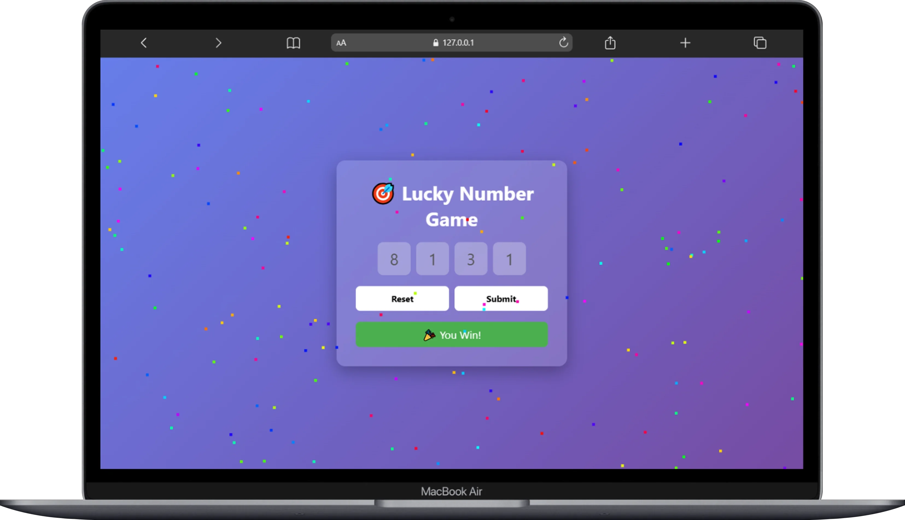
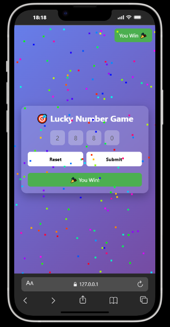

# 🎯 PIN HUNT

🔗 [Play Now](https://pin-hunt.webdevzone.in)

A fun and interactive **4-digit PIN guessing game** built using pure HTML, CSS, and JavaScript.
Test your luck, crack the code, and enjoy a playful twist with a hidden developer console surprise 😈

---

## ✨ Key Highlights

- ⚡ Fast and lightweight (no frameworks)
- 🔢 OTP-style input with auto focus
- 🎯 Auto-submit on 4th digit entry
- 🎉 Confetti celebration on win
- 😢 Smart feedback with correct PIN reveal
- 🧑‍💻 Funny developer console interaction
- 📱 Fully responsive UI

---

## 🛠️ Tech Stack

- HTML5
- CSS3
- JavaScript

---

## 🚀 Features

- 🔢 Enter 4-digit PIN with smooth input navigation
- ⚡ Instant auto-submit on last digit
- 🎉 Win animation with confetti effect
- ❌ Wrong guess shows correct PIN
- 🔁 Auto reset for continuous gameplay
- 🎯 Keyboard support (Enter to submit)
- 😈 Hidden console message for developers

---

## 📸 Screenshots

📸 
📸 

---

## ⚙️ Installation

Follow these steps to run the project locally:

```bash
# 1. Clone the repository
git clone https://github.com/webdev-desktop/Pin-Hunt.git

# 2. Navigate into the project folder
cd Pin-Hunt

# 3. Open in browser
Open index.html
```

---

## 🧑‍💻 How to Play

1. Enter a 4-digit number
2. The input auto moves like OTP
3. On the last digit → game auto submits
4. If correct → 🎉 You win
5. If wrong → 😢 Correct PIN is revealed
6. Game resets automatically 🔁

---

## 🔮 Future Improvements

- 🔢 Attempt counter system
- ⏱️ Timer-based challenge mode
- 🏆 Leaderboard system
- 🔊 Sound effects (win/lose)
- 🎨 Theme customization

---

## 🤝 Contribution

Contributions are welcome!

```bash
# Fork the repo
# Create a new branch
git checkout -b feature/your-feature

# Commit changes
git commit -m "Add your feature"

# Push to branch
git push origin feature/your-feature
```

Then open a Pull Request 🚀

---

## 👨‍💻 Author

**Apurv**
🔗 [GitHub](https://github.com/webdev-desktop)

---

## 📄 License

This project is licensed under the **MIT License**.

---

## ⭐ Support

⭐ If you enjoyed cracking the code, don't forget to star the repo!
